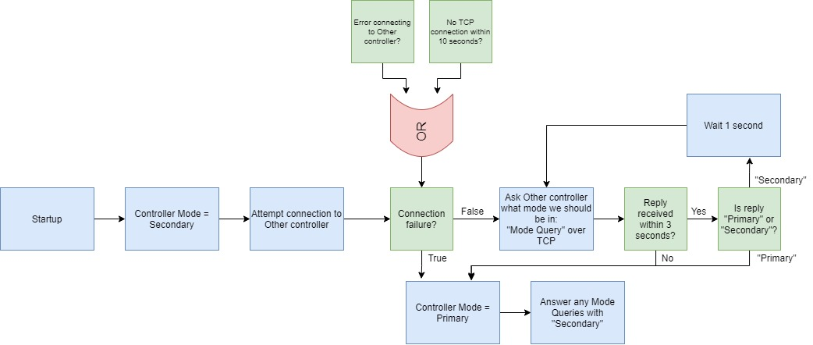
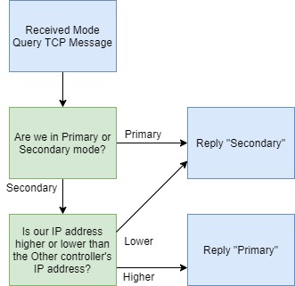

# Design Review

## Goals
Machines should boot assuming they are secondary controllers, until they can communicate over C2C to determine who is primary. If both think they are secondary, they need to decide who is primary. If no connection between controller comes up, they need to wait an appropriate amount of time before assuming primary.

## Affected Repos
cops

config

## Approach
**C2C** utilizes Go's `net` package to create a persistent TCP connection between two ports that serves as a communication interface for each HybridOS machine. The machine with the lower IP address is arbitrarily set as the TCP server and the machine with the higher IP address is arbitrarily set as the TCP client. In test scenarios when the two ports are on the same machine, the port number takes the place of the IP address in this comparison.

**On startup,** COPS will set the initial controller mode to Secondary. It will attempt to connect to the Other controller. If connection fails or (for server only) a timeout of 10 seconds is hit, COPS will set the controller mode to Primary. If connection succeeds, COPS will begin sending Mode Query C2C messages to the Other controller.

**If the controller is in Primary mode,** it will not send Mode Query C2C messages. It will ignore any "Primary" or "Secondary" messages coming from the Other controller, and it will only answer incoming Mode Query C2C messages with "Secondary".

**If the controller is in Secondary mode,** it will send periodic Mode Query C2C messages to the Other controller every 1 second and pay attention to replies. If the Other replies "Secondary", COPS will stay in Secondary. If the Other replies "Primary", COPS will set the controller mode to Primary. If the Other does not reply within a timeout of 3 seconds, COPS will set the controller mode to Primary.

**When COPS receives a Mode Query C2C message,** it will reply with either "Primary" or "Secondary", indicating in what mode it wants the Other controller to be. If the controller is either in Primary mode or is in Secondary mode and has a lower IP address than the Other, it will reply with "Secondary" to the Other. If the controller is in Secondary mode and has a higher IP address than the Other, it will reply with "Primary" to the Other.

_Potential Problem: TCP connection between the two machines is compromised, but each of their connections to the power system is not. Both try to be Primary controller and issue commands. Is this possible?_

### Flowcharts
Negotiating Controller Mode

Received Mode Query C2C Message

### References
https://golang.org/pkg/net/#Dial

## Interface
The C2C communication infrastructure will utilize a basic TCP client-server communication protocol to interface with another HybridOS machine.

_Question: What IP addresses and port numbers will facilitate the C2C interface?_

## Testing
C2C will be tested by sending pings back and forth between two running HybridOS machines.

_Question: Where to run HybridOS besides my virtual machine? Is it even necessary to test on two separate machines?_

Primary controller negotiation will be tested by starting both machines at the same time, and by starting one machine but not the other. Watching what boxes enter primary versus secondary controller mode will verify negotiation algorithm.

## Backward Compatibility
No

## Configuration
_Question: Where will IP address/ports be read from? Will each machine be reading from the same config file, or two different config files?_