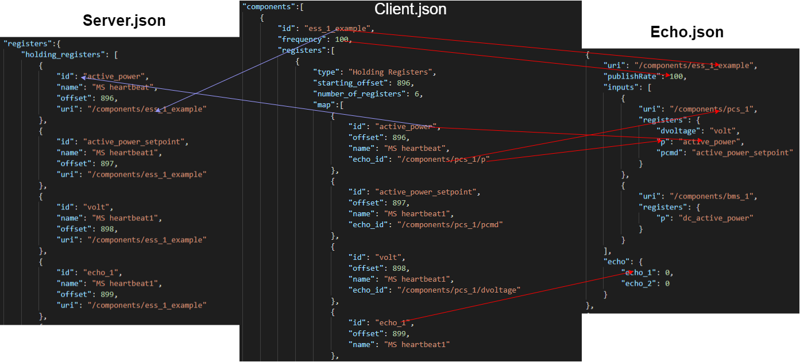

# Echo/Interceptor Demo Walkthrough

Explain the procedure of what happens when you run the client file into the executable

For the information that is being sent to the server file
- id from the components which becomes the uri for the register 
- all the information from the map section from client file minus the echo_id.

There is a lot more information that is sent to the echo file. 
- The components id will become the second fragment of the output URI.
- The frequency will become the publishRate of the URI
- The register id becomes the remap for the last fragment of the echo_id
- The last fragment of the echo_id becomes the left side of the remap
- Any register that dont have an echo_id will be put in the echo map with a value of zero

We are going to clone all the repos that we will need for this.
the repos that we will need are fims, twins and echo.
- `sudo yum install echo`
- `sudo yum install fims`
- `sudo yum install twins`

<!-- After those repos have been cloned we will have to make sure that `package_utility` is up to date
We will use the command `git submodule update --init`
Next we will run `./package_utility/build.sh` for all the repos -->

For this demo we will be using a premade client file and twins file so that we will all be on the same page
You can find the client file at `https://github.com/flexgen-power/echo/blob/bugfix/echo_get/configs/EXAMPLE/example.json`
You can find the twins file at `https://github.com/flexgen-power/echo/blob/bugfix/echo_get/configs/twins.json`

We will be using this client file to generate the server and echo files that are used for the modbus connection and echo executable
To generate the server and echo files we will be using the echo executable
There are two ways to use this executable, one way is using the executable that is created from the `build.sh` which is in `/usr/local/bin`
or going to the `src` file in the echo repo. For the purpose of the demo I will be using the `/usr/local/bin` executable
So we are on the same page we will `cd` into the echo repo, from there we will run the command
`/usr/local/bin/echo -config configs/EXAMPLE/example.json -mode modbus`
now we will check the folder where the config is and see that there are two more files which are the server and echo json file
We will now go into the echo.json file so that we can modify it so that certain registers will be deleted

This what it will look like if you do not change the echo file, it will look very similiar except for the bottom where you will see a volt register this is the register that we took out using the echo file

In the echo.json file we will be looking at the output uri of `/components/ess_1_example` under registers. 
We will be changing the register remap of dvoltage_percent from volt to null
This action will make it so that that register will not be remapped and not show up in the output publish in FIMS

After we are satisfied with the changes that we have made to the echo.json, we will start our processes that will run in the background.
To run fims_server we will do `/usr/local/bin/fims_server &`
To run twins we will do `/usr/local/bin/twins git/echo/configs/twins.json &`

After those are running we will run the echo executable with this command
`/usr/local/bin/echo -run -config=configs/EXAMPLE/example_echo.json`
This will spit out a large amount of text which is good
