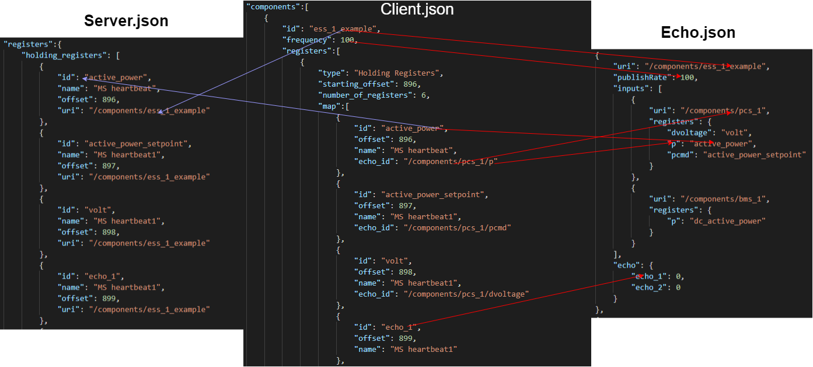

# Echo/Interceptor
## Repos required for this to work
    - fims
    - twins
    - echo

### VERIFICATION For if everything works
- To verify that everything is working properly we will be using some example files
    - We will be installing them from Artifactory using these commands
        - `sudo yum install echo`
        - `sudo yum install fims`
        - `sudo yum install twins`
- Step 1:
    - For this verification please download this premade client file [example.json](configs/EXAMPLE/example.json)
    - For this verification please download this premade twins file [twins.json](configs/twins.json)
- Step 2:
    - Run this command to generate the server and echo file
    - `/usr/local/bin/echo -c </path/to/example.json> -mode modbus -output </path/to/destination>`
    - There is an output flag that will allow you to generate the files to where ever you want
    - Check the output folder to make sure that they generated, default is folder with client
- Step 3:
    - Run `/usr/local/bin/fims_server &`
    - Run `/usr/local/bin/twins <path/to/twins.json> &`
- Step 4:
    - Run this command to start the echo executable
    - `./echo <path/to/example_echo.json>`
    - You should see a map of forward and backwards links
    - If something breaks please contact Claire Levinson/Ani M for help
- Step 5:
    - In another terminal run a `fims_listen -u /components/ess_1_example`, look for these registers in your listen, if they are there then you are fine
    ```json
    {"active_power":-1.75,"active_power_setpoint":0,"dc_active_power":0,"volt":0.99}
    ```
    - Now run another `fims_listen -u /components/ess_2_example` look for these registers in your listen, if they are there then you are fine
    ```json
    {"door":-2.1049228564205107,"factive_power":0,"factive_power_setpoint":0,"needtochange":-1.75}
    ```
    - Now run another `fims_listen -u /components/ess_3_example` look for these registers in your listen, if they are there then you are fine
    ```json
    {"echo_1": 0, "echo_2": 0, "echo_3":0}
    ```
- Step 6:
    - If everything matches then congrats you have set up echo correctly!

### Step by Step process for Echo:
- Step 0: Installing the echo, fims, twins rpms from artifactory
    - We will be installing them from Artifactory using these commands
        - `sudo yum install echo`
        - `sudo yum install fims`
        - `sudo yum install twins`
- Step 1: Locate the client.json that you will want to be to be converted into a server.json and echo.json
- Step 2: Run the generation of the server and echo file
    - `<path/to/echo> -c <path/to/client.json> -mode modbus -output </path/to/destination>`
    - example: `/usr/local/bin/echo -c ~/git/echo/config/client.json -mode modbus -output ~/git`
    - server and echo file will go in the same location as the client, unless an output flag is specified for a location
- Step 3: Make sure the configs were generated and do any modifications to echo.json for remapped or deletion of registers
- Step 4: Run fims_sever and twins in the background
    - Depending on fims, naviagate to fims_server executable `fims_server &`
    - Depending on twins, naviagate to twins executable `twins <path/to/twins.json> &`
- Step 5: Run the continuous loop echo executable
    - `<path/to/echo> <path/to/echo.json>`
    - example: `/usr/local/bin/echo ~/git/echo/config/echo.json`

### Generate a modbus_server.json and echo.json
`/usr/local/bin/echo -config <path/to/example_client.json> -mode modbus -output </path/to/destination>`
- The `-config` flag tells the program which client file the user wants to use 
- The `-mode` flag tells the program which type config that is going to be converted into a server and echo.json file
- The `-output` flag tells the program where you want to deposit the server and echo file

- When this command is run, the config that is given will be converted to a server file and an echo.json file. The server file can be used in term with the client file.
- The creation of the server and echo files will be in the same location of the client file, unless an output flag is specified for a location
- For the echo.json, it will needed to be manually modified with remapping and metrics in the deletion or creation of registers

### Execute runtime operation
`/usr/local/bin/echo <path/to/echo.json>`
- There are no flags required to run the program

### Echo_ids with in client files
- Echo_ids are used to remap fully qualified URIs to the components id
- This takes the value from the register in the URI and assigns it to the URI for the output
    - Example: Value from `/components/pcs_1/p` will be the value of `/components/ess_1_example/active_power`
    ```json
    {
        "components":[
            {
                "id": "ess_1_example",
                "frequency": 100,
                "registers":[
                    {
                        "type": "Holding Registers",
                        "starting_offset": 896,
                        "number_of_registers": 1,
                        "map":[
                            {
                                "id": "active_power",
                                "offset": 896,
                                "name": "MS heartbeat",
                                "echo_id": "/components/pcs_1/p"
                            }
                        ]
                    }
                ]
            }
        ]
    }
    ```
- You add echo_ids for every register you want to remap under the map array that is in the config

### Structure of how the client file registers can look
### Registers that have a mix of remapped registers and echo registers. 

- Example of what one looks like
```json
{
    "id": "active_power",
    "offset": 896,
    "name": "MS heartbeat",
    "echo_id": "/components/pcs_1/p"
},
{
    "id": "active_power_setpoint",
    "offset": 897,
    "name": "MS heartbeat1",
    "echo_id": "/components/pcs_1/pcmd"
},
{
    "id": "volt",
    "offset": 898,
    "name": "MS heartbeat1",
    "echo_id": "/components/pcs_1/dvoltage_percent"
},
{
    "id": "dc_active_power",
    "offset": 901,
    "name": "MS heartbeat1",
    "echo_id": "/components/bms_1/p"
},
{
    "id": "echo_2",
    "offset": 751,
    "name": "MS heartbeat1"
},
{
    "id": "echo_3",
    "offset": 752,
    "name": "MS heartbeat1"
}
```
### Registers that have a register that references an existing output register
- Registers that reference other registers, the other registers must exist before the reference
- Example of what one looks like
```json
{
    "id": "needtochange",
    "offset": 869,
    "name": "MS heartbeat1",
    "echo_id": "/components/ess_1_example/active_power"
}
```
### Registers that have no echo_ids

- Example of what one looks like
```json
{
    "id": "echo_1",
    "offset": 750,
    "name": "MS heartbeat"
},
{
    "id": "echo_2",
    "offset": 751,
    "name": "MS heartbeat1"
},
{
    "id": "echo_3",
    "offset": 752,
    "name": "MS heartbeat1"
}
```

### Explanation of file name scheme
- If the client file name is `example.json` then the server and echo files will be `example_server.json` and `example_echo.json`
- If the client file name is `example_client.json` then the server and echo files will be `example_server.json` and `example_echo.json`
- The server and echo json files will be generated into the same folder as the client file, unless an output flag is specified for a location


### Structure of Echo Repository

- `src` Directory
    - Directory that holds the executble to launch the echo program

- `configs` Directory
    - Directory that holds the configs that are used for testing

- `pkg` Directory
    - Directory that holds all the go modules that are used within the creation of configs and metrics

### Modules in the `pkg` Directory
- `config` module
    * Module that helps with different client files (modbus|dnp3), both client file types are enabled
- `metrics` module
    * Module that helps with creating new output registers with basic functions

### Modifications that the file generation does


### Process of File Creation

- Running the program along with a modbus_client.json file will be changed into a modbus_server.json and echo.json
- The program will iterate through the client files component array and get the id for the component that the registers are assigned to. These will be your output uris.
- This is the step where the fileInfo and system sections of the server file are created
- After id is extracted, the map array that is in the components is iterated through to get all the register information
- For the register information, the program wants just the register id and the echo_id. Id is used for the remapping in echo.json and the echo_id is to determine if the register needs to be echoed. 

- After id is extracted again, the map array that is in the components is iterated through to get all the register information for the echo.json. There is a lot more information for the echo.json. This also creates a map of all the echo registers
- The diagram above shows what is extracted and where it is put in the echo.json

- The server file is created first and then the echo.json is created. The process of iterating through the client file is done at the same time to help save time going through config again.

### Process of FIMS loop

- After the file generation, and you run the program with an echo.json. First, the program reads the echo.json config to get it stored.
- Next, it makes the input, process and output map to store internal data.
- For input map it will just create an empty map, output map will insert all the echo registers that are in the echo field in the echo.json.
- For the Process Map, we makes Links that help with Forwarding and Backwarding values from fims to controller or vice-versa.
    * A map is created and for each output a map of forwards and backwards links are created.
    * For each register remap in the input array a forwards link is created
    * The backwards link is just a copy of what is in the registers field of inputs
- After the maps are created, it waits for a FIMS message to come through.
    * For a publish from FIMS, it will add the body to an input Map internally
    * Then it will add to the output map that will then be published
- addToOutput Function (the remapping process)
    * It will loop through the echo.json outputs, then it loop through the list of backwards links
    * If the value does exist then it will remap the name and then assign the value from the FIMS message to the outputMap value
    * If the value of one of the links is nil then it will delete it from the inputMap so that it doesnt get added to the output message
- There is a pubticker that will be constantly be sending out all the output uris

### Metrics in Echo

- Example of an echo file that had a metrics section
```json
{
    "outputs":
    [
        {
            "uri": "/components/ess_1",
            "publishRate": 100,
            "inputs":
            [
                {
                    "uri": "/components/pcs_1",
                    "registers":
                    {
                        "active_power": "p",
                        "active_power_setpoint": "pcmd",
                        "FPS": "fcmd"
                    }
                },
                {
                    "uri": "/components/bms_1",
                    "registers":
                    {
                        "dc_active_power": "p",
                        "dc_APS": "numracks",
                        "dc_FPS": "avgcelltemp"
                    }
                }
            ],
            "echo":
            {
                "echo_1": 10,
                "echo_2": 20,
                "echo_3": 0
            },
            "metrics":
            [
                {
                    "uri": "/components/pcs_1/fcmd",
                    "operation": ["add", "subtract", "multiply", "divide", "add"],
                    "inputs":
                    [
                        { "uri": "/components/ess_1", "id": "echo_1" },
                        { "uri": "/components/ess_1", "id": "echo_2" },
                        { "uri": "/components/ess_1", "id": "echo_1" },
                        { "uri": "/components/ess_1", "id": "echo_2" },
                        { "uri": "/components/ess_1", "id": "echo_1" }
                    ],
                    "value": 10,
                },
                {
                    "uri": "/components/ess_1/dc_APS",
                    "operation": ["forward"],
                    "inputs":
                    [
                        { "uri": "/components/ess_1", "id": "active_power_setpoint" }
                    ]
                },
                {
                    "uri": "/components/bms_1/avgcelltemp",
                    "operation": ["forward"],
                    "inputs":
                    [
                        { "uri": "/components/pcs_1", "id": "fcmd" }
                    ]
                },
                {
                    "uri": "/components/ess_1/echo_3",
                    "operation": ["forward"],
                    "inputs":
                    [
                        { "uri": "/components/ess_1", "id": "echo_2" }
                    ]
                }
            ]
        }
    ]
}
```

- Current working functions in the metrics library are add, subtract, multiply, divide, forward
- All metric operations must be in a list/array to properly work ex. ["forward"]
- Operations can be chained in one metrics operation as show in the first object above, the number of registers must be one more than the amount of operations if using add, subtract, multiply, divide
- The field "value", mainly used for add, subtract, multiply, divide, will allow you to have a static value that is used at the END of the calculation
- Explanation of operations:
    * ADD:
        - You add two numbers together
    * SUBTRACT:
        - You subtract two numbers
    * MULITPLY:
        - You multiply two numbers together
    * DIVIDE:
        - You divide two numbers
    * FORWARD
        - Allows you to assign the input value to the uri value
- "uri field must be a fully qualified URI meaing it must have 3 sections or fragments. Can be a twins or echo URI as long as echo URI shows up before 

- Overall structure of a modbus server file

```json
{
    "fileInfo": {
        "fileName": "",
        "fileCreated": "",
        "lastModified": "",
        "createdBy": "",
        "lastModifiedBy": ""
    },
    "system": {
        "name": "TWINS TX 100 BMS",
        "protocol": "Modbus TCP",
        "version": "1.0 WIP",
        "id": "",
        "comment_ip_address": "192.168.1.8",
        "comment_port": 502,
        "ip_address": "0.0.0.0",
        "port": 0,
        "device_id": 0,
        "off_by_one": false
    },
    "registers": {
    }
}
```

- Overall structure of an echo file
```json
{
    "outputs":
    [
        {
            "uri": "",
            "publishRate": 100,
            "inputs":
            [
                {
                    "uri": "",
                    "registers":{}
                }
            ],
            "echo": {},
            "metrics":[]
        }
    ]
}
```


### DEVELOPER USE ONLY

### To build within the echo repo: 
`$ cd src/ && go build`

### View help flags
`$ ./src -h`

### Generate a modbus_server.json and echo.json
`$ ./src -config=../configs/clients/example_client.json -mode=modbus -debug`
- The `-config` flag tells the program which client file the user wants to use 
- The `-mode` flag tells the program which type config that is going to be converted into a server and echo.json file
- The `-debug` flag will print out debug statements during the convertion process

- When this command is run, the config that is given will be converted to a server file and an echo.json file. The server file can be used in term with the client file.

- The creation of the server and echo files will be in the same location of the client file, unless an output flag is specified for a location

- For the echo.json, it will needed to be manually modified with remapping and metrics in the deletion or creation of registers

### Execute runtime operation
`$ ./src -run -config=echo.json`
- The `-run` flag will tell the program that the user wants to start the echo program
- This `-config` flag will require the path to an echo.json file, since the user wants to run the program
- Depending if there is a `-run` flag will determine which config file you will have to give
