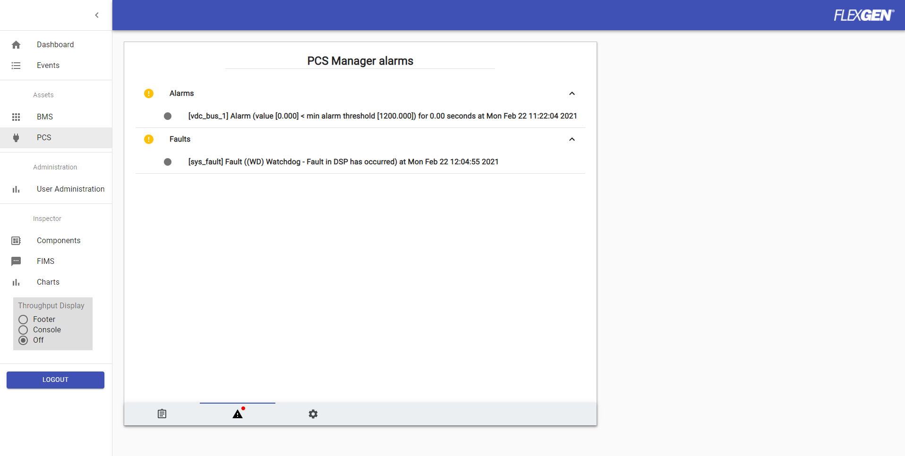
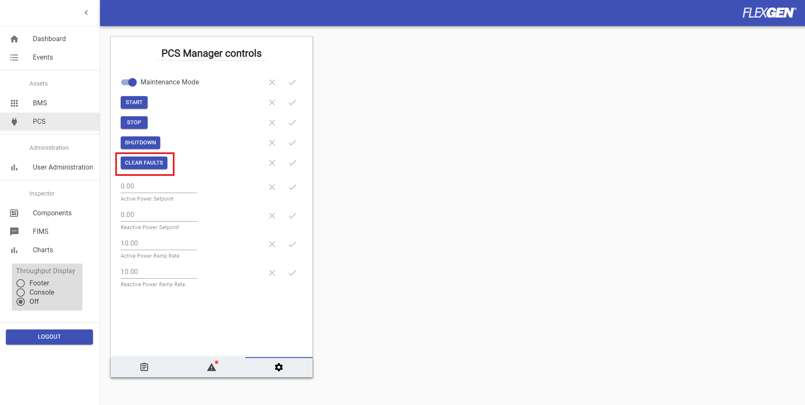

Moving Average Calculations

Author: Phil Wilshire, Jimmy Nguyen

Date Created: 
* 07/13/2021

Date Modified: 

# Overview
Any incoming data item can be "remapped" to a varaible that has this function activated by the variable onSet action.
The Function will store a number of values, defined by the depth,  in a small fifo defined as the vecaV 
This array of values can then be analysed (in real time) and sent on to one or more output variables.

# Setup Variables
### depth
This is the number of successive values that are used to calculate the data outputs

### vecAv
This is the assetVar used to store the vector or list of incoming successive values.

### filtFac
This is the filter factor used in the filter calculations.
y[n] = x*filtFac - (y[n-1]*(filtFac - 1)) 
Where y[n] is the current filter output.

# Output Variables
### outAv
Send the average of up to depth values to this destination.

### outMax
Send the maximum of up to depth values to this destination.

### outMin
Send the minimum of up to depth values to this destination.

### outSp
Send the span (maximum - minimum) of up to depth values to this destination.

### outSum
Send the sum  of up to depth values to this destination.

### outFilt
Send the filtered result of up to depth values to this destination.

# Configuration
### User Interface
Variables to be processed are defined using the following configuration:

### Filter Only Config
Filter only no vecaV or depth needed.

```json
"/status/sbmu_9":
{
      "sbmu_raw_current":{
           "value":0,
          "ifChanged": false,
           "outFilt":"/status/sbmu_9:sbmu_filt_current",
           "filtFac":0.75,
           "actions":{
                "onSet":
                [
                     {
                     "func":
                          [
                               {"func":"MathMovAvg","amap":"ess"}
                          ]
                     }
                ]
           }
      }
}
```

### Full output config
Full output ( depth will default to 16)

```json
"/status/sbmu_9":
{
      "sbmu_raw_voltage":{
            "value":0,
            "ifChanged": false,
            "depth":16,
            "vecAv":"/status/sbmu_9:sbmu_average_voltage_vec",
            "outAv":"/status/sbmu_9:sbmu_average_voltage",
            "outMax":"/status/sbmu_9:sbmu_max_voltage",
            "outMin":"/status/sbmu_9:sbmu_min_voltage",
            "outSp":"/status/sbmu_9:sbmu_span_voltage",
            "outFilt":"/status/sbmu_9:sbmu_filt_current",
            "filtFac":0.75,
            "actions":{
                "onSet":
                [
                     {
                     "func":
                          [
                               {"func":"MathMovAvg","amap":"ess"}
                          ]
                     }
                ]
           }
      }
}
```

System alarms are categorized by the ESS Controller into two types: `faults` and `alarms`. Depending on the type of the alarm, the alarm messages will be located either in `/faults` or `/alarms`. The web interface will display both types of alarms if there are any alarm messages in the ESS Controller and if the `ui_type` of the UI variable is an `alarm`.

In addition to populating alarms, there is also an option to clear the alarms (via the `clear_faults` UI control).

----
### Alarm/Fault Destination and Message
The location of the alarms/faults and the alarm/fault normal condition message (used to prevent alarm/fault messages from being sent)  
can be defined in the configuration file like so:
```json
"/config/pcs": {
    "AlarmDestination": {
        "value": "/assets/pcs/summary:alarms"
    },
    "FaultDestination": {
        "value": "/assets/pcs/summary:faults"
    },
    "NoFaultMsg": {
        "value": "(NOFLTS) No faults"
    },
    "NoAlarmMsg": {
        "value": "(NOWRN) No warnings"
    },
}
```
`AlarmDestination` and `FaultDestination` contain the location the alarm/fault messages will be sent to. 
If sent to `/assets/pcs/summary` for example, then the alarm/fault messages can be viewed in the web UI.

`NoFaultMsg` and `NoAlarmMsg` contain the normal condition string used for comparison (defined in a system alarm handler function).  
These strings are used to help determine whether the hardware devices (ex.: CATL BMS) are still in an alarm or fault state and to
prevent the ESS Controller from sending out a fault/alarm message.  

----

### Modbus Interface
Here are the ways modbus faults/alarms can be configured:

Alarms:
```json
"/components/pcsm_internal_visualization": {
    "current_warning": {
        "value": 0,
        "actions": {
            "onSet": [{
                "enum": [
                    {"shift": 0, "mask": 65535, "inValue": 0, "uri": "/alarms/pcs:sys_warn", "outValue": "(NOWRN) No warnings"},
                    {"shift": 0, "mask": 65535, "inValue": 1, "uri": "/alarms/pcs:sys_warn", "outValue": "(HVAC) High input voltage"},
                    {"shift": 0, "mask": 65535, "inValue": 2, "uri": "/alarms/pcs:sys_warn", "outValue": "(LVAC) Low input voltage"}
                ]
            }]
        }
    }
}
```

Faults:
```json
"/components/pcsm_internal_visualization": {
    "current_fault": {
        "value": 0,
        "actions": {
            "onSet": [{
                "enum": [
                        {"shift": 0, "mask": 65535, "inValue": 0, "uri": "/faults/pcs:sys_fault", "outValue": "(NOFLTS) No faults"},
                        {"shift": 0, "mask": 65535, "inValue": 1, "uri": "/faults/pcs:sys_fault", "outValue": "(WD) Watchdog - Fault in DSP has occurred"},
                        {"shift": 0, "mask": 65535, "inValue": 2, "uri": "/faults/pcs:sys_fault", "outValue": "(HWVBS) HW Vbus - DC overvoltage detected. Threshold: 1520 Vdc"}
                ]
            }]
        }
    }
}
```

* `inValue` is the incoming modbus value read by the ESS Controller. The `inValue` can either be an integer or a bit
  * If the `inValue` is a bit, then `shift` is used for bit shifting, and `mask` is used to indicate which bits to keep for processing
* `uri` is the location and variable to set the value to
* `outValue` is a value to set to the `uri` depending on what the `inValue` is
  * Ex.: `outValue` can be a string representation of the `inValue` received

Note: This modbus configuration is defined in the ess controller configuration, not the modbus server/client configuration.  

To allow system faults/alarms to be processed by an alarm function handler, configure the variables like so:
```json
    "/faults/pcs": {
        "note": "Leave as is for now. This definition is needed for clear faults UI cmd to work",
        "clear_faults": {
            "value": 0,
            "type": "fault",
            "actions": {
                "onSet": [
                    {
                        "func": [
                            {
                                "func": "process_sys_alarm",
                                "amap": "pcs"
                            }
                        ]
                    }
                ]
            }
        },
        "sys_fault": {
            "value": 0,
            "type": "fault",
            "actions": {
                "onSet": [
                    {
                        "func": [
                            {
                                "func": "process_sys_alarm",
                                "amap": "pcs"
                            }
                        ]
                    }
                ]
            }
        }
    },
    "/alarms/pcs": {
        "note": "Leave as is for now. This definition is needed for clear alarms UI cmd to work",
        "clear_alarms": {
            "value": 0,
            "type": "alarm",
            "actions": {
                "onSet": [
                    {
                        "func": [
                            {
                                "func": "process_sys_alarm",
                                "amap": "pcs"
                            }
                        ]
                    }
                ]
            }
        },
        "sys_warn": {
            "value": 0,
            "type": "alarm",
            "actions": {
                "onSet": [
                    {
                        "func": [
                            {
                                "func": "process_sys_alarm",
                                "amap": "pcs"
                            }
                        ]
                    }
                ]
            }
        }
    }
```
The `type` parameter is used to classify whether the assetVar is an `alarm` or a `fault`. The function `process_sys_alarm` is called each time  
an alarm/fault value has been set (which indicates the alarm/fault value has been read from the hardware device).  

----

### Clear Faults
The `clear_faults` and `clear_alarms` assetVar are used to clear fault and/or alarm messages from the ESS Controller. Alarm messages in the ESS Controller and the Site Controller will no longer be displayed in the web interface whenever the clear faults command has been set, either by the ESS Controller/Site Controller web interface or fims.  

Whenever the clear faults command is set, the `clear_faults` and `clear_alarms` assetVar will now be set to `Clear`.

The function `process_sys_alarm` will then run and remove all fault/alarm messages in the ESS Controller. In addition to removing the faults/alarms, the fault/alarm state of assetVars defined in either `/faults` or `/alarms` will be reset (set to value defined in `NoFaultMsg` or `NoAlarmMsg`).  

Fault/alarm messages can be generated by the monitoring assetVar (see [monitoring.md](monitoring.md) for more information on system monitoring).  
When the clear faults command is set, all fault/alarm messages will be removed, but only assetVars defined in `/faults` and `/alarms` will have its state
reset.  

To reset the monitoring assetVar's state as well (ex.: seenFault/seenAlarm), the `clear_faults` and/or `clear_alarms` should look like the following:
```json
"/faults/bms": {
    "note": "Leave as is for now. This definition is needed for clear faults UI cmd to work",
    "clear_faults": {
        "value": 0,
        "type": "fault",
        "numVars": 3,
        "variable1": "monitor_variable_1",
        "variable2": "monitor_variable_2",
        "variableN": "monitor_variable_3",
        "actions": {
            "onSet": [
                {
                    "func": [
                        {
                            "func": "process_sys_alarm",
                            "amap": "bms"
                        }
                    ]
                }
            ]
        }
    }
}
```

`numVars` is the number of monitoring variables to reset the fault/alarm state for, and `variable1, variable2, ..., variableN` is the name of the monitoring variable.  

Note: Faults/alarms can still be latched to the ESS Controller if the fault/alarm has not been resolved, even if the clear faults have been sent.  
Specifically, this means the fault/alarm messages will be repopulated in the ESS Controller and displayed in the UI, indicating the fault/alarm has not been resolved.  


----

### Site Controller
In addition to categorizing system faults/alarms for the ESS Controller, fault/alarms can also be categorized for the Site Controller.

Here is an example of how to configure faults/alarms to be displayed to the Site Controller:

```json
"/components/pcsm_internal_visualization": {
    "current_warning": {
        "value": 0,
        "actions": {
            "onSet": [{
                "enum": [
                    {"shift": 0, "mask": 65535, "inValue": 16, "uri": "/site/ess:pcs1_alarms[16]", "outValue": true, "note": "Bit 16 - Temp abnormal"},
					{"shift": 0, "mask": 65535, "inValue": 90, "uri": "/site/ess:pcs1_alarms[16]", "outValue": true, "note": "Bit 16 - Temp abnormal"},
					{"shift": 0, "mask": 65535, "inValue": 96, "uri": "/site/ess:pcs1_alarms[16]", "outValue": true, "note": "Bit 16 - Temp abnormal"},
					{"shift": 0, "mask": 65535, "inValue": 103, "uri": "/site/ess:pcs1_alarms[16]", "outValue": true, "note": "Bit 16 - Temp abnormal"},
                    {"shift": 0, "mask": 65535, "inValue": 104, "uri": "/site/ess:pcs1_alarms[16]", "outValue": true, "note": "Bit 16 - Temp abnormal"},
                    {"shift": 0, "mask": 65535, "inValue": 390, "uri": "/site/ess:pcs1_alarms[16]", "outValue": true, "note": "Bit 16 - Temp abnormal"},
                    {"shift": 0, "mask": 65535, "inValue": 101, "uri": "/site/ess:pcs1_alarms[20]", "outValue": true, "note": "Bit 20 - DC fuse abnormal"},
                    {"shift": 0, "mask": 65535, "inValue": 372, "uri": "/site/ess:pcs1_alarms[28]", "outValue": true, "note": "Bit 28 - DC switch abnormal"}
                ]
            }]
        }
    }
}
```
In this example, `pcs1_alarms` is a Site Controller variable that contains bit strings. The Site Controller will display alarm/fault messages depending on which bit is set to 1. To indicate which bit to set based on the `inValue`, we use the bracket notation
* Ex.: `/site/ess:pcs1_alarms[16]` indicates we want to set bit 16 for `pcs1_alarms`  


Here is an example of how to clear faults currently stored in the Site Controller from the ESS Controller:
```json
        "clear_faults": {
            "name": "Clear Faults",
            "value":"Init",
            "unit": "",
            "scaler": 0,
            "enabled": false,
            "ui_type": "control",
            "type": "enum_button",
            "actions": { 
                "onSet":[{
                    "remap":[
                        {"inValue": true, "outValue": 0, "uri": "/site/ess_ls:bms_faults1"},
                        {"inValue": true, "outValue": 0, "uri": "/site/ess_ls:bms_faults2"},
                        {"inValue": true, "outValue": 0, "uri": "/site/ess_ls:bms_alarms"}
                    ]
                }]
            },
            "options": [
                {
                    "name": "Clear Faults",
                    "return_value": "Clear"
                }
            ]
        }
```
In this example, whenever a clear faults command is set to true, the alarm/fault registers from the Site Controller will be set to 0, which indicates all fault/alarm messages will be cleared. 

Note: To clear a particular alarm message from the Site Controller, set the bitfield individually like so:
```json
{"inValue": true, "outValue": false, "uri": "/site/ess_ls:bms_alarms[bit_field_to_reset]"},
{"inValue": true, "outValue": false, "uri": "/site/ess_ls:bms_alarms[another_bit_field_to_reset]"}
```

# Data Validation
While the ESS Controller is running, to generate system alarms/faults, you can do the following
1. Fims interface
    * `/usr/local/bin/fims/fims_send -m pub -u /components/pcsm_internal_visualization/current_warning 1`
    * `/usr/local/bin/fims/fims_send -m pub -u /components/pcsm_internal_visualization/current_fault 1`

To view system alarms/faults, you can do the following example:
1. Fims interface
    * `/usr/local/bin/fims/fims_send -m get -u /ess/assets/pcs/summary/alarms -r /me | jq`
    * `/usr/local/bin/fims/fims_send -m get -u /ess/assets/pcs/summary/faults -r /me | jq`
2. Web UI
 

To clear system alarms/faults, you can do the following example:
1. Fims interface
    * `/usr/local/bin/fims/fims_send -m set /assets/pcs/summary '{"clear_alarms":true}'`
    * `/usr/local/bin/fims/fims_send -m set /assets/pcs/summary '{"clear_faults":true}'`
2. Web UI
 
