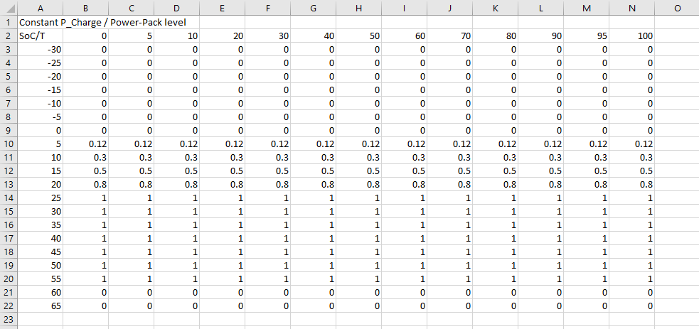

Check Table Value

Author: Jimmy Nguyen

Date Created: 
* 02/26/2021

Date Modified: 
* 03/05/2021 - renamed title from power limiting to check table value

# Overview
The ESS Controller can control the power charge/discharge limiting value depending on the current state-of-charge (SOC) and temperature  
from the BMS or other ESS devices.

To do this, the ESS Controller will parse a comma-separated values (csv) file which contains a two-way table (see configuration below) and  
create a data map out of it. For the data map, the SOC and temperature are stored as key pairs, and the power limiting table value is stored as the value for the specific key pairs.

The ESS Controller will run the `HandlePowerLimit` function periodically, which will set `BMSChargePowerDerate` and `BMSDischargePowerDerate` to the charge/discharge power limiting value depending on the current SOC and temperature.  

Note: this feature is currently not used by the ESS Controller.

# Configuration
Currently, the ESS Controller will parse two csv files: `p_charge_tbl.csv` and `p_discharge_tbl.csv`. Before running the ESS Controller, make sure both csv files are in  
`/usr/local/etc/config/ess_controller`.  

In order for the ESS Controller to parse the csv file and create the data map correctly, the csv file should be formatted like the following:

```
Constant P_Charge / Power-Pack level,,,,,,,,,,,,,
SoC/T,0,5,10,20,30,40,50,60,70,80,90,95,100
-30,0,0,0,0,0,0,0,0,0,0,0,0,0
-25,0,0,0,0,0,0,0,0,0,0,0,0,0
-20,0,0,0,0,0,0,0,0,0,0,0,0,0
-15,0,0,0,0,0,0,0,0,0,0,0,0,0
-10,0,0,0,0,0,0,0,0,0,0,0,0,0
-5,0,0,0,0,0,0,0,0,0,0,0,0,0
0,0,0,0,0,0,0,0,0,0,0,0,0,0
5,0.12,0.12,0.12,0.12,0.12,0.12,0.12,0.12,0.12,0.12,0.12,0.12,0.12
10,0.3,0.3,0.3,0.3,0.3,0.3,0.3,0.3,0.3,0.3,0.3,0.3,0.3
15,0.5,0.5,0.5,0.5,0.5,0.5,0.5,0.5,0.5,0.5,0.5,0.5,0.5
20,0.8,0.8,0.8,0.8,0.8,0.8,0.8,0.8,0.8,0.8,0.8,0.8,0.8
25,1,1,1,1,1,1,1,1,1,1,1,1,1
30,1,1,1,1,1,1,1,1,1,1,1,1,1
35,1,1,1,1,1,1,1,1,1,1,1,1,1
40,1,1,1,1,1,1,1,1,1,1,1,1,1
45,1,1,1,1,1,1,1,1,1,1,1,1,1
50,1,1,1,1,1,1,1,1,1,1,1,1,1
55,1,1,1,1,1,1,1,1,1,1,1,1,1
60,0,0,0,0,0,0,0,0,0,0,0,0,0
65,0,0,0,0,0,0,0,0,0,0,0,0,0
```

Note:
* The first line in the csv file (ex.: Constant P_Charge) and the first field after the first line (ex.: SoC/T) are skipped
* The rest of the data values are used to create the data map  
* The csv file can be converted from an excel spreadsheet. If an excel spreadsheet is used, then the file should be formatted like the following:  
 

# Data Validation
While the ESS Controller is running, to check the power limiting value based on SOC and temperature, you can do the following:
1. Fims interface
    * `/usr/local/bin/fims/fims_send -m pub -u /components/catl_mbmu_summary_r/mbmu_soc 20 `
    * `/usr/local/bin/fims/fims_send -m pub -u /status/ess/mbmu_avg_cell_temperature 5`
    * `/usr/local/bin/fims/fims_send -m get -u /status/bms/BMSChargePowerDerate -r /me`
      * Note: Expected charge power limit value is 0.12
    * `/usr/local/bin/fims/fims_send -m get -u /status/bms/BMSDischargePowerDerate -r /me`
      * Note: Expected discharge power limit value is 1

