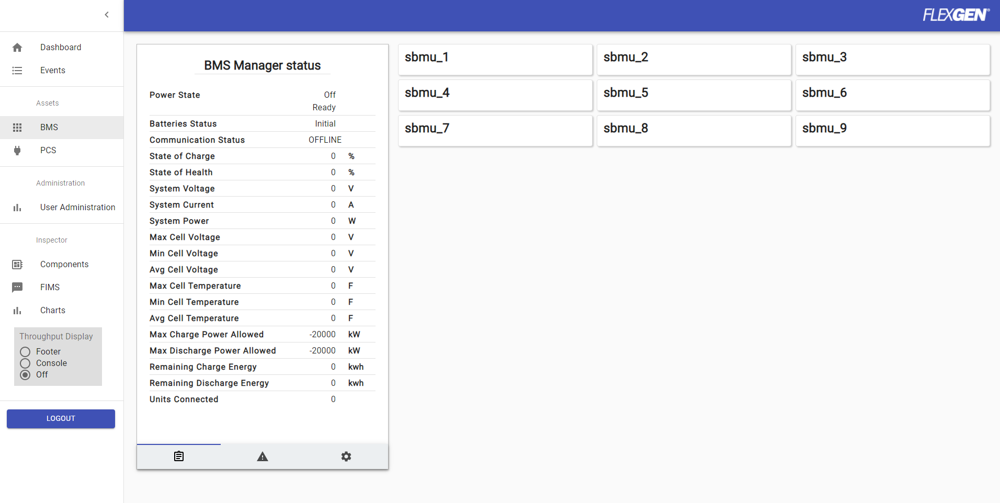
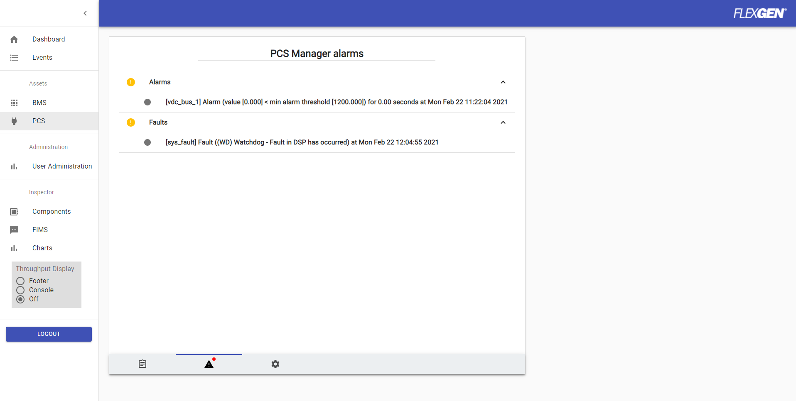

ESS Controller UI

Author: Jimmy Nguyen

Date Created: 
* 02/19/2021

Date Modified:
* 02/25/2021 - added brief description on web_ui.json
* 02/22/2021 - added additional documentation on ui features

# Overview
In the ESS Controller web interface, users can view the dashboard, which displays summary information of the asset managers (ex.: bms, pcs),  
as well as statuses, alarms, and controls for each asset manager and its assets.  

Here are examples of what the ESS Controller web interface can look like:  

### ESS Controller Dashboard
  

### BMS Grid View
  

### PCS View
  

Refer to [guide.md](guide.md) for more details on how to start up the ess controller and run the web server, web ui, and other modules.

# Configuration
Here are some of the items in `web_ui.json` that can be enabled/set to produce the web interface as shown in the previous images above:  
```json
{
    "timezone": "America/Chicago",
    "ess": false,
    "gen": false,
    "solar": false,
    "met_station": false,
    "tracker": false,
    "feeders": false,
    "features": false,
    "site": false,
    "events": true,
    "control_cabinet": false,
    "configuration": false,
    "essController": true,
    "setGrid": ["bms", "pcs"],
    "primaryStatuses": {
    },
    "units": {
        "W": "M",
        "Wh": "M",
        "VAR": "M",
        "VARh": "M",
        "VA": "k",
        "VAh": "M",
        "W/s": "M"
    },
}
```

Note:  
* Add `bms` and/or `pcs` in `setGrid` to enable grid view for either of them
* Set `ess` to `false` to disable the storage module from displaying in the ESS Controller web interface
* Set `events` to `true` to display events in the ESS Controller web interface
* Set `essController` to `true`


For more information on the web ui, check out the [web_ui](https://github.com/flexgen-power/web_ui) repo.  
<br/>


The statuses, faults/alarms, and controls in the ESS Controller web interface are located in `/assets/[asset_manager_name]/summary`.  

## Status
Here is an example (using `bms_manager.json`) of how to configure UI status variables and link them to other variables in the ESS Controller:

To view statuses in UI:
```json
"/assets/bms/summary": {
    "com_status": {
        "name": "Communication Status",
        "value": "INIT",
        "unit": "",
        "scaler": 0,
        "enabled": false,
        "ui_type": "status",
        "type": "string"
    },
    "soc": {
        "name": "State of Charge",
        "value": 76.55913543701172,
        "unit": "%",
        "scaler": 1,
        "enabled": false,
        "ui_type": "status",
        "type": "number"
    }
}
```
To classify the UI variable as a status, the `ui_type` should be set to `status`.

To link the status UI variable to other internal variables:
1) vlink

```json
"/vlinks/bms": {
    "mbmu_soc_ui": { "value": "/assets/bms/summary:soc", "vlink": "/components/catl_mbmu_summary_r:mbmu_soc" }
```
In this example, the UI variable (`soc`) located in `/assets/bms/summary` is linked to the ESS Controller variable (`mbmu_soc`) located in `/components/catl_mbmu_summary_r`.  
Both variables will share the same value, so any changes to one variable will result in the other linked variable receiving the same changed value as well.

Note: The order the URI and variable are defined in `value` and `vlink` does not matter.


2) action onSet (remap or enum)

```json
"/status/bms": {
    "CommsOK": {
        "value": false,
        "actions": {
            "onSet":[{
                "remap":[
                    { "inValue": true,  "uri": "/assets/bms/summary:com_status",  "outValue": "ONLINE"},
                    { "inValue": false, "uri": "/assets/bms/summary:com_status",  "outValue": "OFFLINE"}
                ]
            }]
        }
    }
}
```
In this example, any changes to the ESS Controller variable (`CommsOK`) will cause the UI variable (`com_status`) to receive a different value (`outValue`).  
For instance, if `CommsOK` is set to true, then `com_status` in `/assets/bms/summary` will be set to `ONLINE` (indicating active communication between ESS Controller and BMS)

Note: `inValue` and `outValue` are optional.  
* Add `inValue` if you want to clearly separate the incoming variables read by the ESS Controller. If omitted, the inValue will use the `value` field in the ESS Controller variable
  * Ex.: Separate incoming values to true and false to set the target variable to a different value, if needed
* Add `outValue` if you want to set the target variable to a different value. If omitted, the target variable will be set to the same value set to the ESS Controller variable

Statuses will be displayed in the web interface status page like the following:

  

----

## Alarms
Here is an example (using `pcs_manager.json`) of how to configure UI alarm variables and link them to other variables in the ESS Controller:

To view alarms in UI:
```json
"/assets/bms/summary": {
    "alarms": {
        "name": "Alarms",
        "value": 0,
        "options": [],
        "unit": "",
        "scaler": 0,
        "enabled": true,
        "ui_type": "alarm",
        "type": "number"
    },
    "faults": {
        "name": "Faults",
        "value": 0,
        "options": [],
        "unit": "",
        "scaler": 0,
        "enabled": true,
        "ui_type": "alarm",
        "type": "number"
    },
}
```
To classify the UI variable as an alarm, the `ui_type` should be set to `alarm`.  
Alarms generated either by the ESS Controller or the hardware devices (ex.: BMS, PCS) managed by the ESS Controller will be located in either `/faults` or `/alarms`.  

Alarms located in either of these URI locations will be displayed in the web interface alarms page like the following:  

 

In the alarms page, the alarm message will consist of the following: 
* Source name (ex.: `sys_fault`)
  * This is usually the assetVar either classified as a fault and/or an alarm or a monitoring variable
* Description of what caused the fault and/or alarm
* Timestamp

Note: Refer to [alarms.md](alarms.md) for more information on how to configure faults and alarms.

----

## Controls
Here is an example (using `pcs_manager.json`) of how to configure UI control variables and link them to other variables in the ESS Controller:

To view controls in UI:
```json
"/assets/pcs/summary": {
    "start": {
        "name": "Start",
        "value": false,
        "unit": "",
        "scaler": 0,
        "enabled": false,
        "ui_type": "control",
        "type": "enum_button",
        "actions":	{
            "onSet":	[{
                "remap":	[
                    {"uri":	"/assets/pcs/summary:start@enabled", "outValue": false}, 
                    {"uri":	"/assets/pcs/summary:stop@enabled"},
                    {"uri":	"/assets/pcs/summary:shutdown@enabled"},  
                    {"uri":	"/assets/pcs/summary:clear_faults@enabled"},
                    {"uri":	"/assets/pcs/summary:clear_alarms@enabled"},
                    {"uri":	"/assets/pcs/summary:maint_active_power_setpoint@enabled"},
                    {"uri":	"/assets/pcs/summary:maint_reactive_power_setpoint@enabled"},

                    {"inValue": true, "uri": "/sched/pcs:schedStartupPCS@endTime", "outValue": 0},
                    {"inValue": true, "uri": "/sched/pcs:schedStartupPCS", "outValue": "schedStartupPCS"},
                    {"uri": "/status/ess:xUiShutdown@ShutdownPCS", "outValue": false},
                    {"uri":	"/status/ess:xUiShutdown", "outValue": false} 
                ]
            }]
        }
    },
    "clear_faults": {
        "name": "Clear Faults",
        "value":"Init",
        "unit": "",
        "scaler": 0,
        "enabled": false,
        "ui_type": "control",
        "type": "enum_button",
        "actions": { 
            "onSet":[{
                "remap":[
                    {"inValue": true, "uri": "/faults/pcs:clear_faults", "outValue": "Clear"},
                    {"inValue": true, "uri": "/alarms/pcs:clear_alarms", "outValue": "Clear"}
                ]
            }]
        },
        "options": [
            {
                "name": "Clear Faults",
                "return_value": "Clear"
            }
        ]
    },
    "maint_active_power_setpoint": {
        "name": "Active Power Setpoint",
        "value": 0,
        "unit": "kW",
        "scaler": 1,
        "enabled": false,
        "ui_type": "control",
        "type": "number",
        "options": []
    }  
```
To classify the UI variable as a control, the `ui_type` should be set to `control`.

To link the control UI variable to other internal variables:
1) vlink
* see example above
2) action onSet (remap or enum)
* see example above

Check out the `Clear Faults` section in [alarms.md](alarms.md) for more information on how faults/alarms are cleared.  

Controls will be displayed in the web interface controls page like the following:

 
