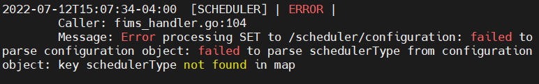

# Here lay the usage for the go_flexgen/Logger package
## Introduction and helpful links

- This logger utilizes the open source logging package zerolog. Here is a link to the source [github](https://github.com/rs/zerolog), and the [docs](https://pkg.go.dev/github.com/rs/zerolog). 
- I encourage users to stick to the usage below rather than create their own functionality/logs. If you are not precise with zerolog ordering will be inconsistent. 

## Basic usage
Import the package with
```
import (
    Logging "github.com/flexgen-power/go_flexgen/logger"
)
```

If you do not already use command line flags you must include the flags package in main.
```
import (
    "flag"
)
```

Then make a call to 
```
// in main
flag.Parse()
```
At the top of main, or wherever convenient. It needs to occur before any logging. 

After you've parsed the command line you need to initialize the logger. Make a call to Logging.InitializeLogger("nameOfExecutable"). So,
```
// in main
flag.Parse()
Logging.InitializeLogger("COPS")
```
The string passed to InitializeLogger will be used to construct the filepath and to distinguish loggers. So using the example of cops above,
Location of logfile becomes -> /var/log/flexgen/cops/cops.log, and the logger's moniker becomes COPS, when logging to console is enabled will log as follows,



If running in the vm environment there is a chance that your vm will not have permission to log to /var/log... you may need to explicitly create the needed folders/files before logging. 

After the steps above have been completed you can use/replace all of your logs.

## Logging
There are different logging severities. The severity determines if a log actually prints to screen. This defaults to severities greater than Debug. You can overwrite this as we will see later in the README.

Severities are as follows. 
```
type Severity int8						// used with severity enum directly following

// "Enum"
const (
    PANIC Severity = 5
    FATAL Severity = 4
    ERROR Severity = 3
    WARN Severity = 2
    INFO Severity = 1
    DEBUG Severity = 0
    TRACE Severity = -1
)
```

When logging each severity has a party of functions. 

They follow the format of:

1. severityf which has printf style usage. For example,
```
Logging.Errorf(format, args...)
``` 
2. msgseverity which logs a message and takes in a string. For example,
```
Logging.MsgError("some string")
```
3. errseverity which logs exclusively an error by adding a json entry of error. For example,
```
var someError error
someError = errors.New("meme error")
Logging.ErrError(someError)
```
4. and fullseverity which takes in a string and error and logs a message and and error. For example, 
```
var someError error
someError = errors.New("meme error")
Logging.FullError("some string", someError)
```

## Fatals and panics
There are Logging.Fatalf() and Logging.Panicf() functions that will perform as you would expect. Fatal logs and immediately kills the program. Panic makes a log and then calls panic()

## Redundant Logging
If the same message is received multiple times, it will only be logged once for every interval given by the RedundantRateS (seconds) set in configuration. For example, a rate of 120 would mean that the message would only be written to the log once every 2 minutes. The default rate is 10 seconds if not provided, and any rate less than or equal to 0 disables the feature so that every message is logged. Additionally, this functionality is only provided for severity levels of INFO, WARN, and ERROR, as TRACE and DEBUG logging has been given full verbosity, and FATAL and PANIC will restart the process and can be controlled via the service file restart rate instead.


To prevent high consumption of memory, the record of redundant messages can be cleared at a configurable rate (in minutes) as well, given by the ClearRateM. This optional variable defaults to 60 if not provided, and can be set to 0 to disable the feature.