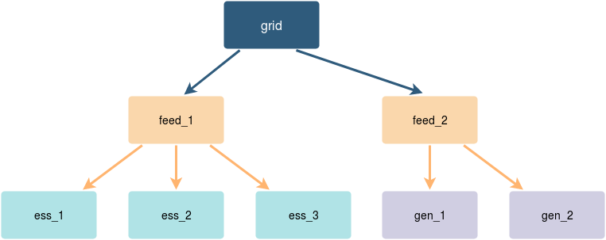

# PSM


## What is this module, and what does it do?

PSM is a power system simulator connected directly to FIMS. It simulates all the `/components` required for a system using a combination of its own configuration file `psm.json`, and the existing `assets.json`. PSM is written in [Go](https://golang.org/), which required a little side project to re-implement libFIMS in Go.

## What doesn't it do?

PSM is meant to be a fast behavioral model simulator to get close enough for development of HybridOS features. It does not:

1. Simulate sine waves or provide sub-line cycle results
2. Handle unbalanced loads or fault studies
3. Guarantee power and reactive power sum to zero at all simulation steps

## Are you eating other peoples' HIL resources? STOP IT

Emulated components:

* [ESS](doc/ess.md)
* [Generators](doc/gen.md)
* [Grids](doc/grid.md)
* [Feeders](doc/feed.md) 
* [Loads](doc/load.md)
* [Solar](doc/pv.md)
* [Transformers](doc/xfmr.md)

## Configuration

You can control:

* Update rate in clock-time
* Publish rate
* Time acceleration, so battery capacity can be given in real units
* List of assets with initialized states (such as SOC, running mode, etc.)
* Configuration of control word integers and bitfield status
* The power system tree
* One asset publishing as multiple, so you only have to define one feeder but can get it to show up as a meter and a relay on FIMS
* How certain data points publish to FIMS by way of a `"psm_id"` directive in `assets.json`

More configuration details are available in the component documentation above as well as [Common Configuration](doc/config.md).

### PSM config

```javascript
{
	"updateRate":100, // How often, in ms, the tree updates
	"publishRate":1000, // How often the components publish
	"timeMultiplier":60, // How many times faster than real time
	// When true, disables the periodic update, see Manual Tick section
	"manualTick":false, 
```

### Components

```javascript
"feeds":[ // also gens, ess, loads, grids, solar, transformers
	{
		"id":"sel-351-7a", // Match the component id in assets.json
		// This asset will also publish and accept commands on the aliased URIs
		"aliases":["sel-735"] 
		"pmax":10000, // All fields can be initialized here,
		"qmax":10000, // including commands.
		"smax":11000, // Unitialized fields will default to 0, 
		"closed":true, // false, "" or [] as appropriate
		"polrev":true
	},
```

### Tree

```javascript
"root":{
	"id":"grid", // Use the same IDs defined in components above
	"children":[ // Children can be omitted for leaf nodes (ess, load, etc.)
		{
			"id":"sel-351-7a",
			"children":[
				// Tree is stored in a map, order of execution is
				// therefore not guaranteed
				{ "id":"flexgen_ess_1" }, 
				{ "id":"flexgen_ess_2" }, 
				{ "id":"emcp_1" },		 
				{ "id":"emcp_2" },
				{ "id":"load_fixed" },
				{ "id":"load_rand"}
			]
		}
	]
}
```

### Assets.json

```javascript
"generators":[
	"id":"gen_1",
	"components":
	[
		{
			// match this id in component config
			"component_id": "emcp_1", 
			"variables":
			{
				"active_power":
				{
					"name": "AC Active Power",
					"register_id": "active_power",
					"value": null,
					"scaler": 1000,
					"unit": "W",
					"psm_id":"p"
					// Match id to PSM component field
				},
```

## Solver



The solver proceeds in three phases. Each phase navigates down the tree,sending terminal values, (power, voltage, frequency, droop characteristics). The animation above shows an older one phase solver, but still shows how data travels up and down the tree.

### Find voltages/frequencies

1. Navigate down the tree with voltage/frequency from the root node. 
2. Call `UpdateMode()` on each node in the tree. This will process commands and mode changesassign the voltage from the root node down, unless a feeder is open. 
3. At grid forming nodes, `GetLoadLines()` returns droop parameters based on the asset's last P and Q output, return up. Transformers transform droop parameters here through the turns ratio
4. At open feeders or the root note, compare all load lines and compute V and F for that node

###  Collect power and load lines

1. Traverse down the tree again with the found voltage/frequency for each node via `DistributeVoltage()`
2. `CalculateState()` on grid following assets, returns their commanded P and Q and send up
3. `CalculateState()` on grid forming assets does nothing
3. At open feeders or root node, hold collected P and Q, but don't send up

### Distribute grid forming power

1. Traverse down a new drooped voltage and frequency through `DistributeLoad()` so assets can determine their grid forming output
2. `UpdateState()` on grid forming assets, work out P and Q based on the new drooped V and F and pass up
3. `UpdateState()` on grid following assets should return up the same thing as in `CalculateState()`
4. `UpdateState()` on feeders determines their trip state for the next tick, and transformer losses for next state
3. `UpdateState()` changes assets' operating points and internal state, such as SOC

## Manual Tick

Normally PSM runs with fixed timesteps for realtime simulation for demos or development. For automatic regression testing or for faster-than-realtime modeling, a process can command PSM to take a solver step with a given step size. This can be accomplished with a message of the form

```
method: set
uri: /psm/tick
replyTo: /what/ever
body: <timestep in seconds>
```