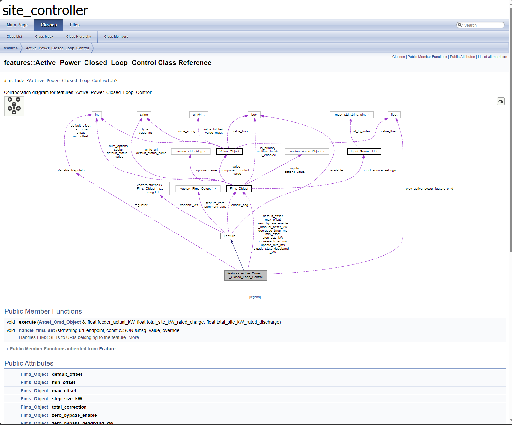

# Doxygen
To use automatically generated documentation to explore site_controller documentation, install doxygen from the following link:
https://www.doxygen.nl/manual/install.html

After successful installation you can run the following command from this directory:
```bash
doxygen .doxygen-config
```

This will output files into the subdirectory ./doxygen.
Then from this directory run the following command:
```bash
cd doxygen/html/; python3 -m http.server 8080
```

This will open a server where you can inspect the generated html files which appear like the following:


These files can be navigated from the bars at the top. They can be useful but in general aren't used as a standard for documentation.
