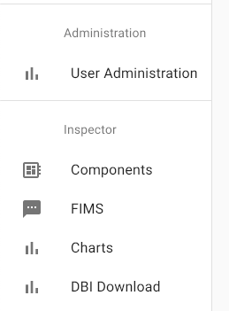

# Design Review - Download Configurations from DBI

## Goals

"As a commissioning engineer I want to be able to download JSON config files [from `dbi`, using the UI]." `dbi` was created to store, update, and retrieve configs and other data from any HybridOS module by way of properly-formatted FIMS messages. Commissioning Engineers and others will want to download configs and/or other data from `dbi` for review and revision without using a command line or a MongoDB shell. This DR shows a method of providing download functionality from `dbi` using the HybridOS browser UI.

## Affected Repos

* `web_ui` needs a page for users to select and download configs, the internal routing for that page, functions to retrieve collection and document names, and then to retrieve and download the desired document.
* `web_server` needs security modifications, request ID tracking additions for returning the response once it is retrieved from `dbi`, and new routing to send `dbi` responses to `web_ui`.
* `dbi` needs the additions of a `showCollections` function and a `showDocuments` function so `web_ui` can retrieve that info to populate drop-down menus so users can choose the documents they want to retrieve. Some changes to other functions are needed to incorporate these new functions into `dbi`.
* `config` needs modifications to the `developer` role to allow access to `dbi` through `web_server`. At the same time, the `rest` and/or `readWrite` roles can be modified to allow access through the REST API to `dbi`. Note that `dbi` can be accessed through the REST API prior to any changes proposed in this Design Review, as long as the proper permissions are in place in config.

## Approach

When this Design Review is approved, the resulting Pull Requests in the above repos will work together to allow `dbi` to be queried for the names of collections and the short details of documents it contains so a query for a specific document can be formulated and fulfilled. The UI (or any module that can write to the file system) can then download the document (the .json data) for the user. This DR shows a method of providing that functionality using the HybridOS browser UI.

### Flow of Operations

In the UI, the user (logged in as a `developer` which means "any FlexGen technical user") will see a tab under the "Inspector" section on the left side of the UI like this:

When the user clicks that tab, `web_ui` will simultaneously open the "DBI Download" page and automatically send a `_show_collections` GET query to `dbi` to populate a drop-down menu where the user can select a collection. Once the user selects a collection from the drop-down menu, `web_ui` automatically sends a `_show_documents` GET query to `dbi` and populates another drop-down menu where the user can select a document. Once a document is selected, the user clicks a button labelled "Download". `web_ui` then sends a GET query with reference to the particular document in the uri of the GET, receives the response, and prompts the user with a Save dialog box. The user then navigates and/or renames as they wish and clicks "Save" to save the document. All documents in a collection can be downloaded as one object by selecting "All Documents" in the document drop-down menu. "All Documents" is the default in the document drop-down menu saving the user a click if they know they want all the documents at once.

* The `_show_collections` query looks like this in FIMS: `/usr/local/bin/fims/fims_send -m get -u /dbi/_show_collections ''`
* The `_show_documents` query looks like this in FIMS: `/usr/local/bin/fims/fims_send -m get -u /dbi/[collection name]/_show_documents ''`
* The query for a specific document looks like this in FIMS: `/usr/local/bin/fims/fims_send -m get -u /dbi/site_controller/assets ''`
* The query for all documents in a collection looks like this in FIMS: `/usr/local/bin/fims/fims_send -m get -u /dbi/site_controller ''`

*Note that in future feature enhancements, more "granularity" will be possible in specifying documents using document ids and version information.*

### Details of Query Responses

The response from `dbi` to a `_show_collections` query is an object with a key of `collections` and a value array list of the collections present, formatted as in this example:
`{ collections: [ 'site_controller', 'ess_controller' ] }`

The response to `_show_documents` (which requires reference to which collection you want the information for) is returned as an object with a key of `documents` and a value array list of the document names with basic info about those documents, formatted as in this example:
`{ documents: [ { assets: { _id: '602bd7686bbdbefa5a080e67', __v: 0, assets_objects: 7 } }, { feeders: { _id: '602bd8416bbdbefa5a080e9b', __v: 0, feeders_objects: 4 } } ] }`

The basic info about each document included in the _show_documents response, as you can see, is `_id` (auto-generated by MongoDB), `__v` (also auto-generated, but we can leverage it or substitute it later), and `[document name]_objects` indicating how many objects are in that document for comparison between documents of the same name. Use of document ids and versions is not implemented in this PR, but having them here as placeholders now sets the foundation for future feature enhancements.

With a list of available collections and then a list of available documents within a particular collection, a user can easily download whatever document they want from `dbi`. 

## Interface

The interface for the user is the HybridOS browser interface. A tab called "DBI Download" under the "Inspector" section on the left side menu in the UI opens a page called "DBI Download" which contains the drop-down menus for selecting the desired document along with a "Download" button to complete the operation. The final response from `dbi` automatically prompts the UI to display a Save dialog box for the user to navigate and/or rename the .json file as they wish.

The REST API, given the proper permissions in config, can access every available function in `dbi`. Once the Pull Requests resulting from this DR are merged, the REST API will also be able to use the `_show_collections` and `_show_documents` functions in `dbi`.

## Configuration

No separate configuration steps are required. Once the Pull Requests resulting from this DR are merged, connections to, and communication with `dbi` is automatic.

## Testing

This low-volume functionality will be manually tested with various data in `dbi` to make sure that:
* all the collections are always correctly returned,
* in the case of no collections existing, the UI will convey that fact to the user and not cause any errors,
* all the documents within any one collection are always correctly returned with correct "metadata",
* in the case of no documents existing in any one collection, the UI will convey that fact to the user and not cause any errors,
* data is correctly downloaded,
* downloaded data defaults to the correct file suffix,
* downloaded data is a valid JSON object

## Backward Compatibility

This is a new feature requiring the coordinated update of multiple repos. Assuming all those repos are "in synch", there are no compatibility issues with any other HybridOS module. If the repos are not in synch, the only problem I forsee is that the "DBI Download" feature in the UI will not work - you won't be able to download.