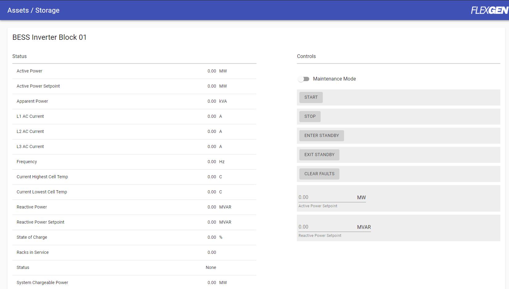
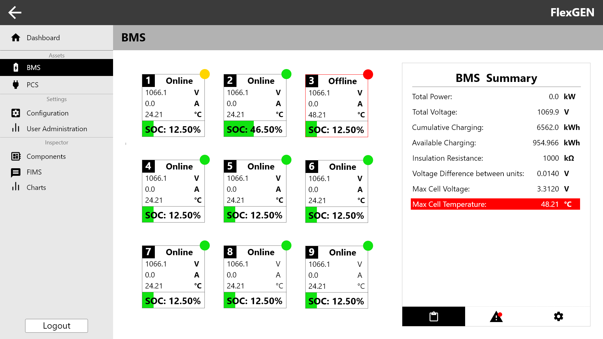
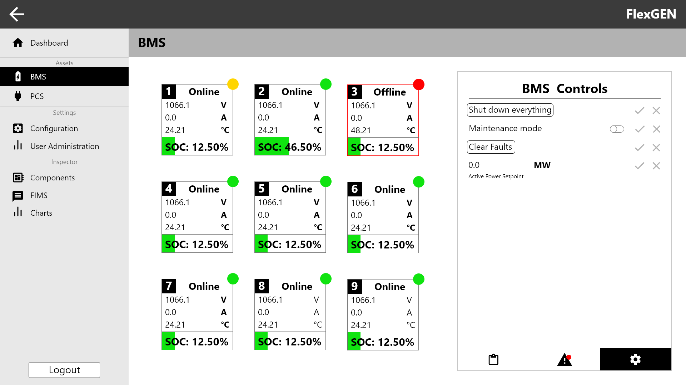

# Hierarchical Data View (HDView)

## Goals

Due to multiple levels of units in ess_controller and potentially other systems, as well as the large amounts of data for each unit, a page will be created that can display all units and their respective data in levels, allowing for a tree style navigation through the system.

## Affected Repos

`web_ui`

## Approach
HDView will use the same data URI as other systems of similar purpose. For example site controller uses `/assets/bms`, which is the same URI that HDView will use. Currently `AssetsPage.js` is a long scrolling page. This may not be efficient with large groups of data or units. An example is shown below.

> /assets/bms\
> {\
> &nbsp; &nbsp;summary: {data}\
> &nbsp; &nbsp;rack_1: {data}\
> &nbsp; &nbsp;rack_2: {data}\
> &nbsp; &nbsp;rack_3: {data}\
> &nbsp; &nbsp;...\
> }

HDView will allow for quick switching between components without having to search manually for the correct scroll position.

> /assets/bms\
> {\
> &nbsp; &nbsp;summary: {data}\
> &nbsp; &nbsp;rack_1: {data}\
> &nbsp; &nbsp;rack_2: {data}\
> &nbsp; &nbsp;rack_3: {data}\
> &nbsp; &nbsp;...\
> }

The HDView page will consist of two main components, the tab component ( `HDViewTab.js`, shown on the left ) and the card grid component ( `HDViewGrid.js`, shown on the right ). The tab component displays information for the entire unit until a card in the grid is selected. Then it will switch to the unit that specific card corresponds to, as shown below. The grid is variable and will automatically update based on the number of components. By nature of screen space, the more components that need to be displayed will reduce the number of 'quick view' statuses available.

> /assets/bms/rack_3\
> {\
> &nbsp; &nbsp;total_voltage: { value: 1066.1, unit: V, ... }\
> &nbsp; &nbsp;total_amps: { value: 0.0, unit: A, ... }\
> &nbsp; &nbsp;current_temperature: { value: 48.21, unit: °C, ... }\
> &nbsp; &nbsp;total_power: { data }\
> &nbsp; &nbsp;...\
> }

The tab component will render 3 different components depending on the tab that is selected: statuses, alarms/faults, controls. The statuses tab delivers the same statuses as `AssetsPage.js` using the corresponding uri and any field marked with `ui_type: status`. By default the statuses tab will show statuses for the entire system. If a card is selected then it will only show the statuses for that particular unit. For example if we are looking at `/assets/ess` then the statuses will display a summary of all ess. If one is selected, then it will display a status for that particular ess (e.g. `ess_1`). The statuses will also be able to show statuses that are related to faults. In the example above, the cell temperature has caused a fault somewhere in the system and is thusly highlighted.

> /assets/bms/rack_3\
> {\
> &nbsp; &nbsp;total_voltage: {data}\
> &nbsp; &nbsp;total_amps: {data}\
> &nbsp; &nbsp;current_temperature: {data}\
> &nbsp; &nbsp;total_power: {data}\
> &nbsp; &nbsp;...\
> &nbsp; &nbsp;fault_1: { name: 'overheating', location: 'BMS_3', options: ['temperature above fault level', 'fire suppression activated'] }\
> &nbsp; &nbsp;alarm_1: { name: 'Temp High Alert', location: 'BMS_1', options: ['temperature above 26 °C'] }\
> &nbsp; &nbsp;...\
> }

The alarms/faults tab is a replacement for card displayed alarms. It will show a notification if there are any active alarms or faults on the tab. The alarms/faults will still use `ui_type: alarm` and `ui_type: fault`. The options will still be displayed in addition to the location of the alarm/fault and any other relevant information.

> /assets/bms/rack_3\
> {\
> &nbsp; &nbsp;total_voltage: {data}\
> &nbsp; &nbsp;total_amps: {data}\
> &nbsp; &nbsp;current_temperature: {data}\
> &nbsp; &nbsp;total_power: {data}\
> &nbsp; &nbsp;...\
> &nbsp; &nbsp;fault_1: {data}\
> &nbsp; &nbsp;alarm_1: {data}\
> &nbsp; &nbsp;...\
> &nbsp; &nbsp;shutdown_control: { type: enum_button }\
> &nbsp; &nbsp;maintenance_mode: { type: enum_slider }\
> &nbsp; &nbsp;clear_faults: { type: enum_button }\
> &nbsp; &nbsp;...\
> }

The controls tab will display any controls available to the system or individual unit. These are determined by `ui_type: control`. If a tab is empty it will default to a templated blank message (e.g. "No alarms/faults present"). Also present are individual component configurations. This includes setting different warning thresholds for individual components (outside of global configuration, which will be done in the configuration page).

The card grid component will be a visual representation of each individual unit inside the system. Each card will contain prioritized statuses which will be the first 2 or 3 statuses in the component object (e.g. `/assets/ess {SOC: 12.5%, ...}`). Some examples may be state of charge or temperature as shown in the examples above. Each of these cards are selectable. As mentioned previously, this will switch the tab component from system wide to individual unit.

## Interface

The interface is identical to `AssetsPage.js`. This would be whichever URIs are accessed by `AssetsPage.js` and the FIMS objects sent, for example `/assets/ess` or `/features`. The current structure of the objects sent to `AssetsPage.js` should be identical, except for the ordering. The first two or three statuses in the object will become the priority statuses displayed on the cards. Potentially have a key that marks important statuses or have the web_ui config mark those statuses as important (TBD).

## Testing

Testing of statuses and alarms/faults will be done through verifying that the data is updated correctly in comparison to the old view.

Testing of controls can be done through verifying that items are changed as expected.

These items should mimic the data and controls of `AssetsPage.js`

## Backward Compatibility

Two main differences may not necessarily be backwards compatible. First is the ordering of the statuses, as the first two to three statuses will be displayed in each component in the grid view. Next is the addition of the `{inspectable: true}` key in objects that have children that are also viewable in HDView. Otherwise, there should be no issue with backwards compatibility as it is the same data with a different view.

## Configuration

No configuration is necessary, a switch tab will be available in `AssetsPage.js` 